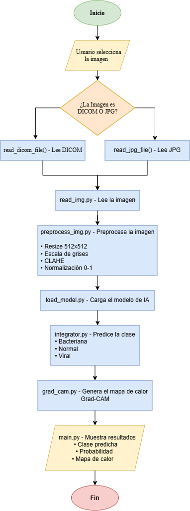

# 🫁 Proyecto Neumonía - UAO

[](https://www.python.org/)
[](https://opensource.org/licenses/MIT)
[](https://github.com/astral-sh/uv)

Breve descripción del proyecto de detección de Neumonía para el curso DDPIA.

## 📂 Estructura del Proyecto

```text
.
├── src/                  # Código fuente de la aplicación (Módulo Python)
├── test/                 # Pruebas unitarias (pytest) - Objetivo: 120 pruebas
├── Dockerfile            # Configuración de Docker
├── docker-compose.yml    # Orquestación de contenedores
├── Makefile              # Comandos de utilidad
├── pyproject.toml        # Dependencias y configuración (uv)
└── README.md             # Esta documentación
```

## 🚀 Instalación y Uso

### Usando UV (Local)

1. Sincronizar dependencias (descarga Python 3.13 si no lo tienes):
   ```bash
   make install
   # o alternativamente: uv sync
   ```
2. Ejecutar la aplicación:
   ```bash
   make run
   # o alternativamente: uv run python src/main.py
   ```
3. Ejecutar pruebas unitarias:
   ```bash
   make test
   # o alternativamente: uv run pytest test/
   ```

### Usando Docker

1. Construir la imagen:
   ```bash
   make build
   ```
2. Levantar el servicio:
   ```bash
   make up
   ```
3. Detener el servicio:
   ```bash
   make down
   ```

## 📊 Diagramas


